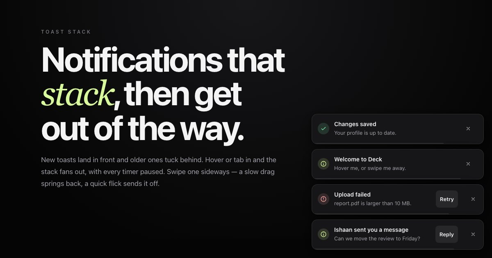

# Deck

A toast stack. New notifications land in front, older ones **tuck behind**,
the stack **fans out** when you reach for it, and a toast **flicks away** with
the speed of your swipe.

**[→ Live demo](https://yagnikbarasiya23.github.io/deck-toast-stack/)**



Zero dependencies. About 16 kB of JavaScript, 5 kB gzipped, plus 1.4 kB of CSS.

## What it does

- **Stacks.** Only the newest toast is fully visible; older ones sit behind it,
  slightly smaller, their edges peeking out by a fixed amount whatever their
  height. Toasts past the limit fade out and become inert.
- **Fans out.** Hover the stack or tab into it and every toast slides into a
  list. All timers pause while you're there, so nothing disappears mid-read.
- **Swipes.** Drag a toast sideways. Let go early or slowly and it springs
  back; drag far enough, or flick fast in the same direction, and it flies off
  with the velocity you gave it.
- **Promises.** `promise()` shows a loading toast and turns it into a success
  or error in place when the work finishes.

## Run it

You need [Node.js](https://nodejs.org) 20.19 or newer.

```bash
git clone https://github.com/YagnikBarasiya23/deck-toast-stack.git
cd deck-toast-stack
npm install
npm run dev
```

Open the URL it prints — usually <http://localhost:5173>.

```bash
npm test          # unit tests for stack layout and swipe decisions
npm run build     # → dist/
npm run preview   # serve what you just built
```

## What's in here

| File | What it does |
| --- | --- |
| `deck.js` | The stack: layout maths, springs, timers, swipe handling and keyboard support |
| `deck.css` | Toast styling, corner positions, tones and the countdown line |
| `index.html`, `style.css`, `app.js` | The demo page |
| `test/deck.test.js` | Tests for collapsed and expanded layout, hiding past the limit, and swipe outcomes |

Only `deck.js` and `deck.css` are needed in your project.

## How it works

**One layout function.** `stackLayout()` takes the toast heights, newest
first, and returns a vertical offset and scale for each. Expanded, offsets
are the running sum of heights plus a gap. Collapsed, each older toast is
shifted so its *far* edge lines up with the front toast's far edge and then
moved out by `i × peek` — so a tall toast behind a short one still shows
exactly a 12 px sliver, not half its body. Bottom corners grow upwards, top
corners downwards; the same function handles both with a sign.

**Springs for x, y and scale.** Each toast has three damped springs. Any
change — a new toast, a dismissal, hover in or out, a toast growing when its
promise resolves — just sets new targets. Motion that's already under way
keeps its velocity, so a burst of five toasts in a second never snaps.

**Swipes that keep their momentum.** Pointer events track a smoothed
velocity. On release `swipeOutcome()` dismisses if the toast travelled 40 %
of its width, or was moving faster than 0.45 px/ms in the same direction it
was dragged. The dismissed toast's spring starts with that velocity, so it
leaves at the speed you threw it. Dragging towards the screen edge the toast
is anchored to is rubber-banded.

**Timers that respect attention.** Each toast tracks its remaining time.
Hovering, focusing, pressing on touch, or hiding the tab pauses every timer;
leaving resumes them. The thin countdown line is a `scaleX` transition that
freezes at the same moment.

Toasts only animate `transform` and `opacity`.

## Accessibility

- The stack is a labelled `region`. Error toasts use `role="alert"`
  (announced immediately); everything else uses `role="status"` (announced
  politely).
- <kbd>Alt</kbd> + <kbd>T</kbd> (configurable) moves focus to the newest
  toast. <kbd>Esc</kbd> dismisses the focused toast, and focus moves to the
  next one instead of being lost.
- Every toast has a labelled close button, so swiping is never required.
- Timers pause while a keyboard user is inside the stack.
- `prefers-reduced-motion: reduce` places and removes toasts without motion.

## Browser support

Current Chrome, Edge, Firefox and Safari. Tone colours use `color-mix()`.

## Using it in your own project

Copy `deck.js` and `deck.css`, then:

```html
<link rel="stylesheet" href="deck.css">

<script type="module">
  import Deck from './deck.js';

  const toasts = new Deck({ position: 'bottom-right' });

  toasts.success('Changes saved');
  toasts.error('Upload failed', {
    message: 'report.pdf is larger than 10 MB.',
    action: { label: 'Retry', onClick: retry },
  });
  toasts.promise(publish(), {
    loading: 'Publishing…',
    success: count => `Published to ${count} feeds`,
    error: 'Publishing failed',
  });
</script>
```

### Options

| Option | Default | |
| --- | --- | --- |
| `position` | `'bottom-right'` | `top-` or `bottom-` + `left`, `center` or `right` |
| `max` | `3` | Toasts visible in the collapsed stack |
| `duration` | `5000` | Default time on screen in ms; `Infinity` keeps a toast until dismissed |
| `gap` | `12` | Space between toasts when fanned out |
| `stiffness` | `260` | Spring stiffness |
| `damping` | `26` | Spring damping |
| `label` | `'Notifications'` | Accessible name of the region |
| `hotkey` | `'Alt+T'` | Modifier + letter that focuses the newest toast |

### Methods and events

| | |
| --- | --- |
| `show({ title, message, tone, action, duration })` | Show a toast; returns its id. `tone` is `info`, `success`, `error` or `loading`. `action` is `{ label, onClick, dismiss? }` |
| `success(title, options)`, `error(…)`, `info(…)` | Shorthands for `show` |
| `update(id, options)` | Change a toast in place |
| `promise(promise, { loading, success, error })` | Loading toast that resolves in place; `success` and `error` may be functions of the result |
| `dismiss(id)`, `clear()` | Remove one or all |
| `configure(options)` | Change any option, including `position` |
| `destroy()` | Remove the region and all listeners |
| `deck:show`, `deck:dismiss` | Fire on the region with `{ id }` |

Theme it with custom properties on `.deck`: `--deck-width`, `--deck-inset`,
`--deck-bg`, `--deck-fg`, `--deck-muted`, `--deck-border`, `--deck-radius`,
`--deck-success`, `--deck-error` and `--deck-info`.

## Licence

[MIT](LICENSE) © 2026 Yagnik Barasiya. Use it in personal and client work.

More components at [yagnikbarasiya.com/components](https://www.yagnikbarasiya.com/components).
